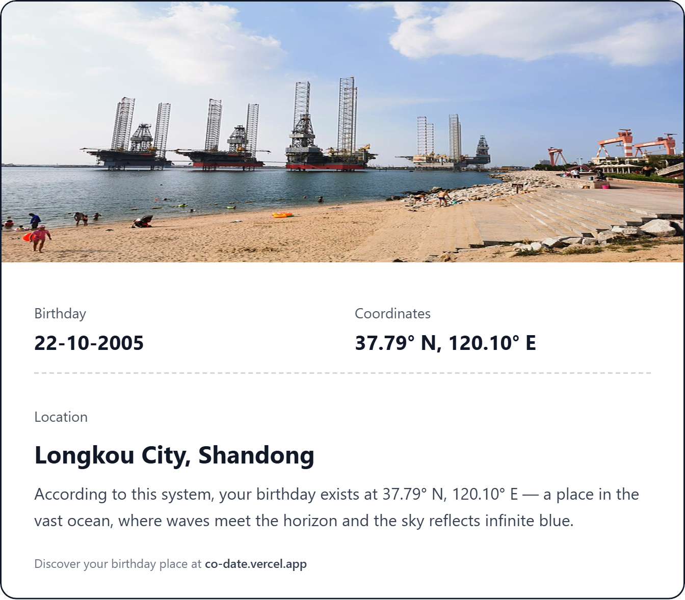

# 🌍 co-date: Your Birthday, Mapped.

> **"Every date creates a coordinate. Find where in the world your birthday lives."**

**co-date** is a whimsical, deterministic explorer that turns your birth date into a specific geographic coordinate on Earth. It's not random—it's math. Using a unique algorithm, we map the non-random nature of the calendar (Days, Months, Years) to the latitude and longitude grid of our planet.



## ✨ The Magic

We believe there's a place for everyone. Literally.
By converting your birth day, month, and year into mathematical values, `co-date` flies you to a specific spot on the globe.

- **Day** defines your Latitude.
- **Month** defines your Longitude.
- **Year** adds a unique variance to avoid collisions.

Is your birthday in the middle of the Pacific Ocean? A bustling street in Tokyo? Or perhaps a quiet desert in Namibia? Find out.

## 🚀 Features

- **📍 Deterministic Geocoding**: Enter the same date, get the same place. Always.
- **🖼️ Smart Visuals**: Automatically fetches high-quality Unsplash images for oceans, deserts, and cities.
- **📸 Polaroid-Style Export**: Generate a beautiful, shareable "card" of your location.
- **🐦 One-Click Sharing**: Optimized for X (Twitter) with auto-image copying and smart pre-filled text.
- **⚡ Blazing Fast**: Built on the Next.js App Router for instant transitions.

## 🛠️ Tech Stack

Built with ❤️ using the best modern web tools:

- **Framework**: [Next.js 14](https://nextjs.org/) (App Router)
- **Styling**: [Tailwind CSS](https://tailwindcss.com/)
- **Maps**: OpenStreetMap (Static & Nominatim API)
- **Capture**: `html2canvas` for generating shareable images
- **Icons**: Heroicons & Custom SVG sets

## 🏃‍♂️ Getting Started

Want to run this locally?

1. **Clone the repo**
   ```bash
   git clone https://github.com/yourusername/co-date.git
   cd co-date
   ```

2. **Install dependencies**
   ```bash
   npm install
   ```

3. **Run the development server**
   ```bash
   npm run dev
   ```

4. Open [http://localhost:3000](http://localhost:3000) with your browser to see the result.

## 🚢 Deployment

The easiest way to deploy your Next.js app is to use the [Vercel Platform](https://vercel.com/new?utm_medium=default-template&filter=next.js&utm_source=create-next-app&utm_campaign=create-next-app-readme).

1. Push your code to a GitHub repository.
2. Go to Vercel and "Add New Project".
3. Import your repository.
4. Click **Deploy**.

## 🤝 Contributing

Got a better formula for mapping dates? Found a bug? Open an issue or submit a PR!

## 📜 License

MIT © [Kavya Goel](https://x.com/goelsahhab)
